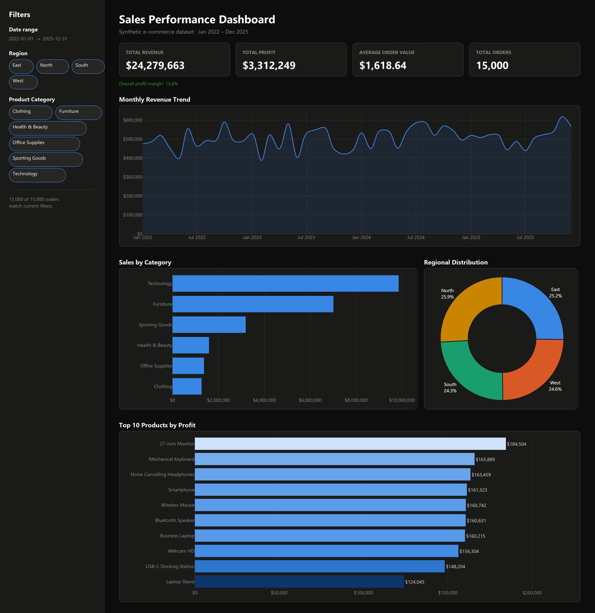

# Sales Performance Dashboard

An interactive sales analytics dashboard built with **Streamlit** and **Plotly**,
running on a synthetic ~15,000-row e-commerce dataset. Dark, professional theme
with filterable KPIs, a monthly revenue trend, category and regional breakdowns,
and a top-products leaderboard.



## Features

- **Filters** — date range, Region (East / West / South / North), and Product
  Category, all in the sidebar.
- **KPI cards** — Total Revenue, Total Profit, Average Order Value, Total Orders
  (plus overall profit margin), all recomputed live from the current filters.
- **Monthly Revenue Trend** — line chart of revenue by month.
- **Sales by Category** — horizontal bar chart.
- **Regional Distribution** — donut chart of sales share by region.
- **Top 10 Products by Profit** — ranked, color-scaled bar chart with a
  toggleable table view (Profit, Sales, Orders).

## Dataset

`data_generator.py` generates a reproducible (seeded) synthetic dataset with:

| Column | Description |
|---|---|
| Order ID | Unique order-line identifier |
| Date | Order date (Jan 2022 – Dec 2025) |
| Customer Segment | Consumer, Corporate, or Home Office |
| Product Category | Furniture, Office Supplies, Technology, Clothing, Health & Beauty, Sporting Goods |
| Product Name | One of ~60 products across the categories above |
| Region | East, West, South, North |
| Sales | Order-line revenue |
| Profit | Order-line profit (category-level margin bands, occasional discounts) |
| Quantity | Units in the order line |

The app calls `generate_data()` directly and caches the result with
`st.cache_data`, so no CSV needs to be committed or loaded at startup. To
export a standalone CSV instead (e.g. for use in another tool):

```bash
python data_generator.py
```

This writes `data/sales_data.csv`.

## Setup

Requires Python 3.10+.

```bash
pip install -r requirements.txt
streamlit run app.py
```

The app opens at `http://localhost:8501`. A dark theme is preconfigured in
[`.streamlit/config.toml`](.streamlit/config.toml).

## Project structure

```
sales_dashboard/
├── app.py               # Streamlit dashboard (filters, KPIs, charts)
├── data_generator.py     # Synthetic dataset generator
├── make_screenshot.py    # Regenerates assets/screenshot.png from the current app/data
├── requirements.txt
├── .streamlit/
│   └── config.toml       # Dark theme config
├── assets/
│   └── screenshot.png
└── data/
    └── sales_data.csv    # Optional exported dataset (python data_generator.py)
```

## Regenerating the screenshot

`assets/screenshot.png` is a composite render built from the app's own chart
functions and color palette (a live browser screenshot wasn't available in
the environment this was built in). If you change the layout, data, or
colors, refresh it with:

```bash
pip install kaleido pillow
python make_screenshot.py
```
